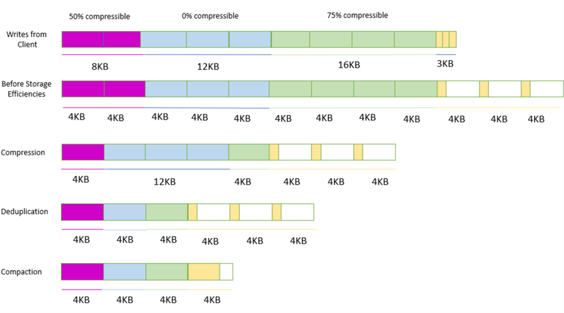

# Cách xác định kích thước hệ thống tệp Amazon FSx cho NetApp ONTAP

Bởi Victor Munoz và Sumaja Kapa, ngày 15 tháng 8 năm 2025 trong in Advanced (300), Amazon FSx, Amazon FSx for NetApp ONTAP, Customer Solutions, Storage, Technical How-to

### Hiểu về Amazon FSx for NetApp ONTAP

Việc chuyển hệ thống và dữ liệu doanh nghiệp lên đám mây có thể phức tạp, nhất là khi bạn mới làm quen với dịch vụ lưu trữ tệp đám mây. Cho dù bạn đang di chuyển từ hạ tầng lưu trữ doanh nghiệp tại chỗ hay chỉ mới bắt đầu với đám mây, việc xác định kích thước lưu trữ chính xác là then chốt để tránh các vấn đề trong tương lai. Phương pháp đúng giúp bạn đưa tệp lên đám mây ngay cả khi đây là lĩnh vực mới với bạn và nhóm của bạn.

AWS cung cấp giải pháp lưu trữ Amazon FSx for NetApp ONTAP, một dịch vụ lưu trữ chia sẻ được quản lý hoàn toàn trên AWS Cloud với các khả năng quản lý dữ liệu và truy cập nổi tiếng của ONTAP. Các tính năng bản địa như deduplication, nén và phân cấp dữ liệu cho phép tối ưu hiệu quả lưu trữ và chi phí khi dung lượng tăng lên. Bắt đầu với kích thước hệ thống tệp FSx for ONTAP phù hợp dựa trên nhu cầu tải công việc giúp bạn tận dụng tối đa khả năng tối ưu dữ liệu tích hợp để giảm thiểu dung lượng và chi phí cần thiết. Độ linh hoạt và tính co giãn của FSx for ONTAP cho phép lưu trữ của bạn điều chỉnh theo tải công việc theo thời gian, tránh phải quản lý thủ công. Lập kế hoạch và sử dụng đúng dịch vụ tệp AWS cho phép bạn chuyển lưu trữ tệp lên đám mây một cách mượt mà và kinh tế.

Trong bài viết này, chúng tôi hướng dẫn cách xác định dung lượng lưu trữ phù hợp khi di chuyển sang FSx for ONTAP. Việc này rút gọn tổng dung lượng lưu trữ, tiết kiệm đáng kể chi phí khi dữ liệu tăng trưởng. Lợi ích áp dụng cho các trường hợp như chia sẻ tệp, kho lưu trữ, sao lưu và phân tích. Phân cấp liền mạch cho phép mở rộng theo yêu cầu. Hơn nữa, khả năng tối ưu dữ liệu của FSx for ONTAP giúp bạn vận hành lưu trữ hiệu quả, tự tin giữ dữ liệu sẵn sàng. Bạn cũng có thể mở rộng dung lượng và băng thông FSx for ONTAP, bằng cách xác định số liệu cơ bản, dự báo tăng trưởng, áp dụng nén/deduplication và điều chỉnh hiệu năng sao cho kinh tế. Chúng tôi cung cấp các thực hành tốt nhất để tối đa hóa giá trị dữ liệu khi nhu cầu thay đổi. Bạn vẫn có thể tăng dung lượng sau khi triển khai, mang lại tính linh hoạt khi yêu cầu biến động. Lưu ý: bạn chỉ có thể tăng, không thể giảm dung lượng SSD đã cấp.

### Hiệu quả dữ liệu

FSx for ONTAP cho phép phân cấp dữ liệu giữa hai lớp lưu trữ: lớp SSD hiệu năng cao và Capacity Pool chi phí thấp, mở rộng linh hoạt. Phân cấp tự động di chuyển dữ liệu ít truy cập từ SSD sang Capacity Pool theo chính sách xác định. Lợi ích chính là tối ưu chi phí bằng cách chuyển dữ liệu lạnh sang lớp rẻ hơn, giữ dữ liệu nóng trên SSD.
FSx for ONTAP cung cấp độ trễ thao tác tệp dưới 1 ms trên SSD và hàng chục ms trên Capacity Pool. Hệ thống còn có hai lớp đệm đọc—ổ NVMe và bộ nhớ trong—giúp giảm độ trễ khi truy cập dữ liệu thường đọc.

### Cấp phát mỏng

Mặc định tất cả volume đều cấp phát mỏng, chỉ sử dụng dung lượng cho dữ liệu thực tế, giúp tiết kiệm chi phí. Người dùng vẫn thấy dung lượng yêu cầu trong khi hệ thống chỉ báo dung lượng đã dùng.

### Deduplication, nén và đóng gói

Deduplication loại bỏ dữ liệu trùng lặp bằng cách thay thế bản sao thừa bằng tham chiếu, giảm đáng kể nhu cầu lưu trữ. Nén giảm kích thước dữ liệu bằng cách mã hóa với số bit ít hơn. Kết hợp, deduplication và nén đem lại khả năng giảm dữ liệu cao, cải thiện hiệu quả lưu trữ. ONTAP sử dụng kích thước khối dữ liệu 4 KB. Một số ứng dụng ghi khối nhỏ không tận dụng hết 4 KB, vì vậy compaction gộp các khối nhỏ đã nén và dedupe vào cùng một khối để tăng hiệu quả, giúp giảm nhu cầu dung lượng thô và chi phí.

### Ví dụ: hiệu quả lưu trữ

Hình 1: minh họa quy trình nén, deduplication và compaction.

> _Hình 1: Biểu đồ hiệu quả lưu trữ minh họa quy trình nén, deduplication và compaction._

Đồ thị trên chia nhỏ quy trình nén, deduplication và compaction theo từng bước. Đầu tiên, dữ liệu được biểu diễn dưới các kích thước khối khác nhau khi được gửi từ client đến volume FSx for ONTAP. Tùy theo nguồn dữ liệu, kích thước khối có thể khác nhau tùy vào thao tác ghi ban đầu. Bước thứ hai cho thấy dữ liệu sẽ được lưu vào volume FSx for ONTAP với kích thước khối được chuyển thành 4 KB cho tất cả dữ liệu nhận được. Bước thứ ba minh họa hiệu ứng của việc nén, giảm không gian sử dụng bên trong khối 4 KB và để lại khoảng trống trong mỗi khối. Bước thứ tư áp dụng deduplication bằng cách xác định và loại bỏ các khối 4 KB trùng lặp, thay thế các bản sao thừa bằng tham chiếu đến một bản duy nhất của dữ liệu. Bước cuối cùng là compaction, tận dụng hiệu quả mọi khoảng trống để kết hợp càng nhiều dữ liệu đã được nén và dedupe vào các khối, giải phóng các khối 4 KB trống. Tất cả các quy trình tối ưu hóa lưu trữ này đều diễn ra trực tiếp (inline) trước khi dữ liệu được ghi lên bộ nhớ SSD.

## Phân cấp (Tiering)

Khi di chuyển dữ liệu lên FSx for ONTAP, người dùng phải phân tích tỷ lệ dữ liệu lạnh (ít được truy cập) và dữ liệu nóng (thường xuyên được truy cập) trong môi trường tại chỗ hiện tại. Để lập kế hoạch phân cấp, người dùng nên xác định tỷ lệ dữ liệu nóng và lạnh bằng cách thực hiện các bước sau:

1. Phân tích nhật ký truy cập tệp và các công cụ phân tích lưu trữ để xác định các tệp được truy cập thường xuyên (nóng) và ít thường xuyên (lạnh).  
2. Kiểm tra thủ công metadata của tệp như thời gian truy cập cuối cùng.  
3. Thu thập thông tin từ chủ sở hữu ứng dụng và người dùng về các mẫu truy cập dữ liệu.  
4. Thiết lập các triển khai thử nghiệm FSx for ONTAP để giám sát các mẫu truy cập.

Việc thường xuyên xem xét các mẫu truy cập dữ liệu này cho phép người dùng xác định chính xác kích thước tầng SSD cho hệ thống tệp FSx for ONTAP của họ, từ đó tối ưu hóa hiệu năng và chi phí.

Phân cấp diễn ra minh bạch trong nền theo các chính sách phân cấp mà bạn thiết lập thủ công trên các volume. Có bốn tùy chọn phân cấp volume:

* Auto: Chính sách này di chuyển tất cả dữ liệu lạnh—dữ liệu người dùng và snapshot—sang tầng Capacity Pool. Tốc độ làm lạnh dữ liệu được xác định bởi chu kỳ làm lạnh của chính sách, mặc định là 31 ngày và có thể cấu hình từ 2–183 ngày. Khi các khối dữ liệu lạnh bên dưới được đọc ngẫu nhiên (như trong truy cập tệp thông thường), chúng trở thành nóng và được ghi vào tầng lưu trữ chính. Khi các khối dữ liệu lạnh được đọc tuần tự (ví dụ, bởi quét antivirus), chúng vẫn lạnh và ở lại trên tầng lưu trữ Capacity Pool.  
* Snapshot only: Chính sách này chỉ di chuyển dữ liệu snapshot sang tầng lưu trữ Capacity Pool. Tốc độ snapshot được phân cấp sang Capacity Pool được xác định bởi chu kỳ làm lạnh của chính sách, mặc định được đặt là hai ngày và có thể cấu hình từ 2–183 ngày. Khi dữ liệu snapshot lạnh được đọc, chúng trở thành nóng và được ghi vào tầng lưu trữ chính. Đây là chính sách mặc định khi tạo volume.  
* All: Chính sách này buộc tất cả thao tác ghi phải phân cấp ngay lập tức sang Capacity Pool. Khi các khối dữ liệu được đọc, chúng vẫn lạnh và không được ghi vào tầng lưu trữ chính. Khi dữ liệu được ghi vào volume với chính sách phân cấp All, nó vẫn được ghi ban đầu vào tầng lưu trữ SSD và được phân cấp sang Capacity Pool bởi một quy trình nền. Metadata của tệp luôn ở lại trên tầng SSD.  
* None: Chính sách này giữ tất cả dữ liệu của volume trên tầng lưu trữ chính và ngăn không cho di chuyển sang lưu trữ Capacity Pool. Nếu bạn đặt volume này thành chính sách này sau khi nó đã sử dụng bất kỳ chính sách nào khác, thì dữ liệu hiện có trong volume đã ở lưu trữ Capacity Pool sẽ được di chuyển sang lưu trữ SSD bởi một quy trình nền miễn là việc sử dụng SSD của bạn dưới 90%. Quy trình nền này có thể được tăng tốc bằng cách cố ý đọc dữ liệu hoặc bằng cách sửa đổi chính sách truy xuất đám mây của volume.

Khi xác định dung lượng lưu trữ SSD cần thiết cho metadata liên quan đến các tệp dự định lưu trữ trên tầng Capacity Pool, bạn nên áp dụng cách tiếp cận thận trọng. Tỷ lệ được khuyến nghị là phân bổ 1 GiB lưu trữ SSD cho mỗi 10 GiB dữ liệu dự định cho tầng Capacity Pool. Nếu bạn chưa quen với mẫu sử dụng của mình, thì bạn nên bắt đầu với tùy chọn "Snapshot only".

## **Băng thông (Throughput)**

FSx for ONTAP cho phép bạn cấu hình dung lượng băng thông mong muốn khi tạo hệ thống tệp. Bạn có thể linh hoạt điều chỉnh dung lượng băng thông này bất cứ lúc nào dựa trên nhu cầu tải công việc. Tuy nhiên, để đạt được băng thông tối đa đã chỉ định, cấu hình hệ thống tệp của bạn phải đáp ứng một số yêu cầu.

Người dùng sẽ bị tính phí cho dung lượng băng thông đã cấp phát. Do đó, bạn nên đánh giá cẩn thận nhu cầu hiệu năng và tìm điểm cân bằng tối ưu giữa hiệu năng và chi phí. Cấp phát quá mức có thể dẫn đến chi phí không cần thiết, trong khi cấp phát quá thấp có thể gây tắc nghẽn hiệu năng.

Người dùng nên theo dõi hiệu năng tải công việc và điều chỉnh tổng dung lượng khi cần thiết để đảm bảo nhận đủ hiệu năng mà không phải trả phí cho dung lượng chưa sử dụng. AWS cung cấp các công cụ như Amazon CloudWatch để giúp giám sát và tối ưu các thiết lập này.

## **Trường hợp sử dụng**

Dưới đây là một số loại tải công việc phổ biến có thể hưởng lợi từ khả năng tối ưu dữ liệu của FSx for ONTAP:

* Chia sẻ tệp: Chia sẻ tệp doanh nghiệp như thư mục home và ổ nhóm chứa nhiều tài liệu và tệp trùng lặp. FSx for ONTAP deduplication tiết kiệm đáng kể không gian lưu trữ.  
* Sao lưu: Dữ liệu sao lưu có nhiều trùng lặp giữa các phiên bản, có thể dedupe. FSx for ONTAP giúp việc lưu trữ sao lưu hiệu quả hơn.  
* Kho mã nguồn: Kho lưu trữ phần mềm có mã trùng lặp giữa các phiên bản và nhánh. FSx for ONTAP giảm dung lượng kho.  
* Kho lưu trữ media: Thư viện media gồm video, hình ảnh, audio có độ trùng lặp cao. FSx for ONTAP compression giảm kích thước kho.  
* Thiết kế điện tử (EDA): Tệp thiết kế cho bán dẫn và điện tử chứa khối dữ liệu trùng lặp. FSx for ONTAP deduplication loại bỏ khối trùng lặp.  
* Phân tích dữ liệu lớn: Dữ liệu thô nhập cho phân tích tạo bản sao trong quá trình ETL. FSx for ONTAP tiết kiệm không gian trước khi nạp vào HDFS.  
* Nghiên cứu gen: Máy giải trình tự gen tạo ra bộ dữ liệu DNA trùng lặp. FSx for ONTAP giúp lưu trữ các bộ dữ liệu lớn này với chi phí phải chăng hơn.

Khả năng giảm dữ liệu của FSx for ONTAP cho phép các tải công việc đa dạng này tối ưu hiệu quả lưu trữ và giảm chi phí khi khối lượng dữ liệu tăng lên. Bảng sau đây đưa ra ước tính về hiệu quả dữ liệu mà FSx for ONTAP có thể đạt được:

| Loại tải công việc | Chỉ nén | Chỉ dedupe | Nén \+ dedupe |
| :---- | :---- | :---- | :---- |
| Chia sẻ tệp chung (home directories) | 50% | 30% | 65% |
| Máy ảo và desktop | 55% | 70% | 70% |
| Cơ sở dữ liệu | 65–70% | 0% | 65–70% |
| Dữ liệu kỹ thuật (EDA) | 55% | 30% | 75% |

## **Đánh giá tải công việc**

Trước khi xác định kích thước hệ thống tệp FSx for ONTAP, bạn phải hiểu đặc điểm của tải công việc tại chỗ. Điều này bao gồm thu thập thông tin về:

Dung lượng dữ liệu: Xác định tổng dung lượng dữ liệu cần lưu, bao gồm cả dữ liệu đang hoạt động và không hoạt động.  
Yêu cầu hiệu năng: Đánh giá throughput dự kiến, Input/Output – Operations per Second (IOPS), và yêu cầu độ trễ cho tải công việc của bạn. FSx for ONTAP cung cấp độ trễ thao tác tệp dưới mili giây với lưu trữ SSD và hàng chục mili giây với lưu trữ Capacity Pool.  
Mẫu tăng trưởng: Phân tích mô hình tăng trưởng dữ liệu lịch sử để ước tính nhu cầu lưu trữ và hiệu năng trong tương lai.  
Mẫu truy cập: Hiểu cách người dùng và ứng dụng tương tác với dữ liệu, chẳng hạn tần suất đọc và ghi.

### **Bước 1: Xác định dung lượng lưu trữ**

Ước tính tổng dung lượng lưu trữ cần thiết cho tải công việc, bao gồm cả dữ liệu hiện tại và dự phòng cho tăng trưởng trong suốt vòng đời hệ thống tệp. Hãy nhớ tính thêm không gian cho metadata, snapshot và các chi phí overhead khác của hệ thống tệp.

### **Bước 2: Chọn cấu hình hệ thống tệp phù hợp**

FSx for ONTAP cung cấp nhiều cấu hình hệ thống tệp với khả năng lưu trữ và hiệu năng khác nhau. Dựa trên yêu cầu tải công việc, lựa chọn cấu hình đáp ứng tốt nhất nhu cầu của bạn về throughput, IOPS và số lượng volume.

Hệ thống tệp FSx for ONTAP hỗ trợ độ sẵn sàng cao và độ bền dữ liệu trên nhiều vùng AWS Availability Zones (AZs). Hệ thống đa vùng (Multi-AZ) có hai file server ở các AZ riêng biệt, trong khi hệ thống đơn vùng (Single-AZ) có một hoặc các cặp file server trong cùng một AZ. Dữ liệu được sao chép tự động giữa các file server để đảm bảo dự phòng. FSx for ONTAP liên tục giám sát lỗi và thay thế thành phần tự động, với thời gian failover và failback thường dưới 60 giây, đảm bảo tính khả dụng liên tục.

Khi lựa chọn giữa hệ thống scale-up và scale-out, cân nhắc yêu cầu tải công việc. Hệ thống scale-up, với một cặp HA đơn, cung cấp tối đa 6 GB/s throughput và 200.000 IOPS, phù hợp cho hầu hết tải công việc tiêu chuẩn như chia sẻ tệp và quản lý nội dung. Với các workload tính toán cao như EDA quy mô lớn, phân tích địa chấn, cơ sở dữ liệu phân tán hoặc ứng dụng HPC, hãy chọn scale-out. Cả hai tùy chọn cho phép di chuyển các workload ONTAP lên AWS mà không cần chỉnh sửa ứng dụng, công cụ hay quy trình làm việc. Chọn scale-out khi cần hiệu năng vượt quá khả năng của một cặp HA đơn, từ đó tận dụng đầy đủ tính năng quản lý dữ liệu của ONTAP trên AWS.

### **Bước 3: Đánh giá tùy chọn lưu trữ và hiệu năng**

FSx for ONTAP cung cấp nhiều tùy chọn về loại lưu trữ, dung lượng và thiết lập throughput/IOPS. Hãy đánh giá kỹ lưỡng để đảm bảo hệ thống tệp đáp ứng được nhu cầu hiệu năng của bạn.

### **Bước 4: Lên kế hoạch mở rộng**

Một trong những lợi ích của FSx for ONTAP là khả năng mở rộng linh hoạt khi nhu cầu thay đổi. Dự đoán tăng trưởng trong tương lai và lập kế hoạch để dễ dàng mở rộng dung lượng và hiệu năng khi cần.

### **Bước 5: Tối ưu chi phí**

Bên cạnh việc đáp ứng yêu cầu tải công việc, cần xem xét tác động chi phí. FSx for ONTAP cung cấp mô hình trả theo giờ sử dụng, không phí tối thiểu hoặc phí khởi tạo. Mặc dù giá được báo hàng tháng, bạn chỉ thanh toán dựa trên mức sử dụng trung bình hàng giờ. Cấu trúc chi phí bao gồm sáu thành phần chính: lưu trữ SSD, IOPS SSD, sử dụng Capacity Pool, băng thông, sao lưu và bản quyền SnapLock. Cân nhắc kỹ các thành phần này để cân bằng giữa hiệu năng, dung lượng và chi phí.

### **Bước 6: Kiểm thử và xác thực**

Trước khi triển khai FSx for ONTAP vào sản xuất, thực hiện kiểm thử và xác thực kỹ lưỡng để đảm bảo đáp ứng yêu cầu hiệu năng và bảo vệ dữ liệu. Việc này có thể bao gồm chạy benchmark, kiểm tra tính toàn vẹn dữ liệu và giám sát hệ thống dưới nhiều tải khác nhau.

## **Di cư (Migration)**

Khi phân tích dung lượng cần thiết, hãy cân nhắc tỷ lệ dữ liệu lạnh và nóng. Hầu hết người dùng xác định tỷ lệ như 80/20—80% lạnh và 20% nóng. Tỷ lệ này giúp bạn thiết lập kích thước tầng SSD khi triển khai hệ thống tệp. Để phân biệt dữ liệu nóng hay lạnh, xem xét tần suất truy cập và yêu cầu độ trễ. Dữ liệu nóng cần sẵn sàng ngay lập tức với độ trễ thấp, ví dụ dữ liệu giao dịch thời gian thực hoặc luồng telemetry, thường lưu trên SSD. Ngược lại, dữ liệu lạnh là dữ liệu lịch sử hoặc lưu trữ, truy cập không thường xuyên và độ trễ chấp nhận được, có thể lưu trên Capacity Pool. Hiểu mẫu truy cập và yêu cầu hiệu năng giúp phân loại chính xác và đề xuất cấu hình lưu trữ phù hợp.

Để tối ưu chi phí, hãy thiết kế tầng SSD nhỏ nhất có thể đáp ứng nhu cầu. Một số cách tiếp cận:

* Chọn tập dữ liệu mục tiêu có kích thước nhỏ hơn dung lượng SSD đang có để đảm bảo hiệu năng và tránh tắc nghẽn. Cách này giúp inline dedupe và nén hoạt động hiệu quả, không làm tăng dung lượng đã sử dụng của hệ thống tệp.  
* Đối với tập dữ liệu lớn hơn kích thước hệ thống tệp, quá trình nền có thể mất khoảng 15 ngày để hoàn thành dedupe và nén trong tầng SSD.  
* Đặt chính sách volume phù hợp (vd. ALL cho dữ liệu lạnh).  
* Giám sát liên tục dung lượng SSD bằng CloudWatch. Khi SSD gần đầy, phân cấp sẽ tự động vô hiệu hóa để tránh tác động hiệu năng hoặc mất khả năng truy cập dữ liệu.

## **Kết luận**

Bằng việc tuân thủ sáu bước đánh giá tải công việc, lựa chọn cấu hình và tối ưu chi phí, bạn có thể xác định chính xác kích thước và cấu hình FSx for ONTAP để đáp ứng nhu cầu lưu trữ tại chỗ, đồng thời đảm bảo hiệu năng, độ sẵn sàng và chi phí tối ưu.

### Victor Munoz 

Victor Munoz là Kiến trúc sư Giải pháp Lưu trữ Cấp cao với kinh nghiệm sâu rộng trong việc thúc đẩy đổi mới hạ tầng lưu trữ doanh nghiệp và quản lý dữ liệu. Ông đã đảm nhiệm các vai trò Kỹ thuật và Kiến trúc tập trung vào nền tảng lưu trữ thế hệ tiếp theo, bảo vệ dữ liệu và tích hợp đám mây tại các công ty công nghệ hàng đầu. Victor đam mê giúp các tổ chức hiện đại hóa môi trường lưu trữ của họ bằng cách tận dụng các khả năng bản địa trên đám mây để đạt tính mở rộng, độ bền và hiệu quả.  |

### Sumaja Kapa 

Sumaja Kapa là Kiến trúc sư Giải pháp Lưu trữ chịu trách nhiệm tất cả các dịch vụ AWS Storage. Cô có kinh nghiệm với nhiều giải pháp Lưu trữ và Sao lưu khác nhau. Sumaja sử dụng chuyên môn này để giải quyết yêu cầu của người dùng, kiến trúc các giải pháp lưu trữ hiệu quả về chi phí, bền bỉ, có thể mở rộng và khả dụng cao nhất trên AWS. Kiến thức kỹ thuật kết hợp với cách tiếp cận lấy người dùng làm trung tâm giúp Sumaja thiết kế những môi trường lưu trữ đám mây sáng tạo, tối ưu hóa cho các nhu cầu đa dạng của doanh nghiệp.  |
| :---- |